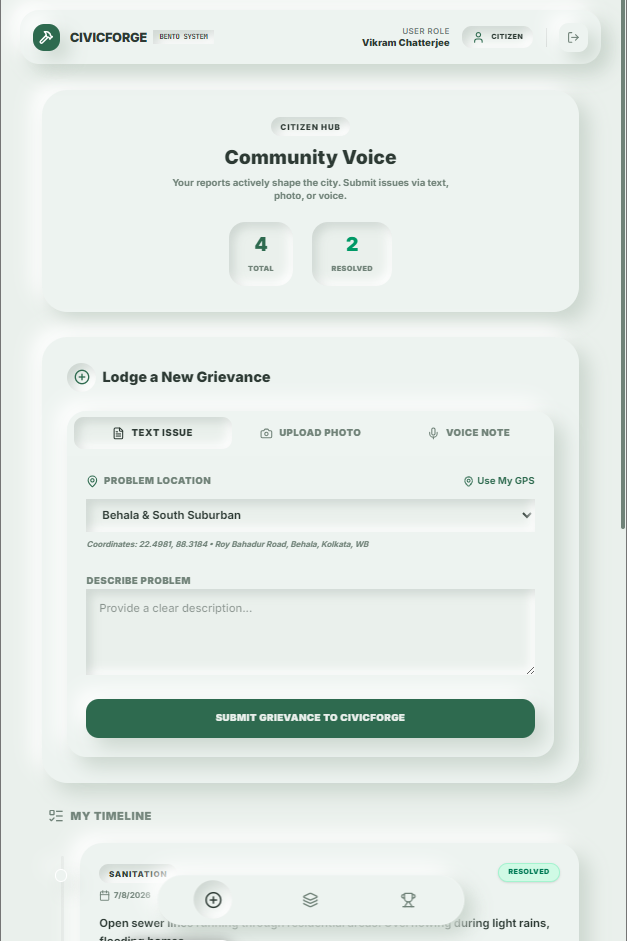
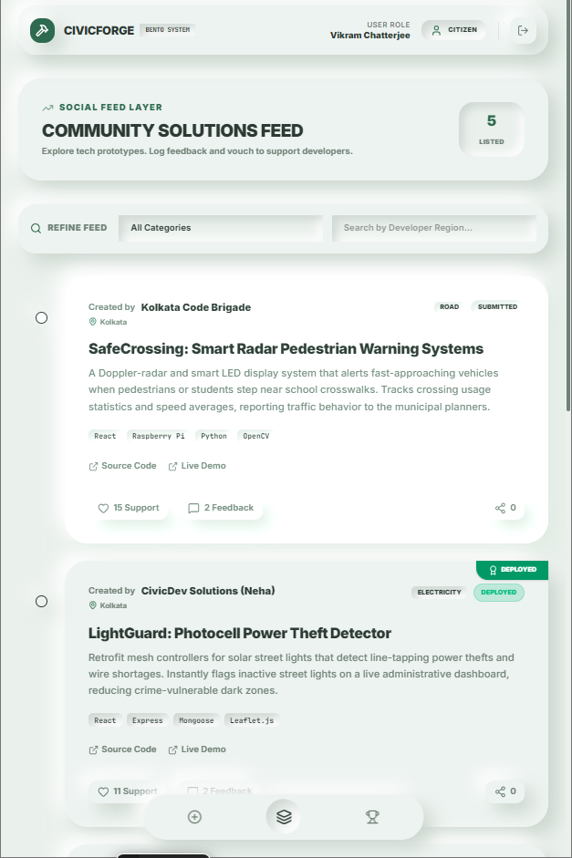
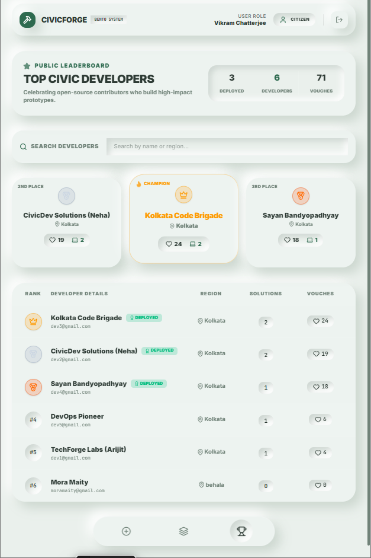
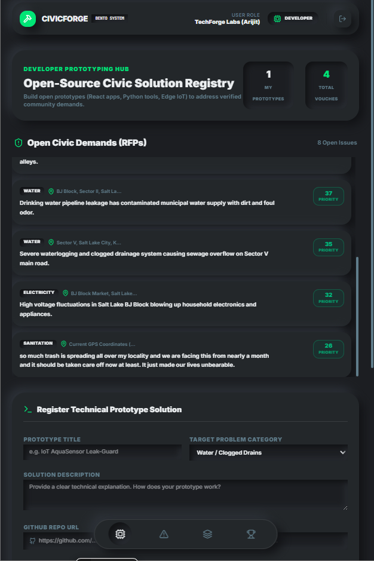
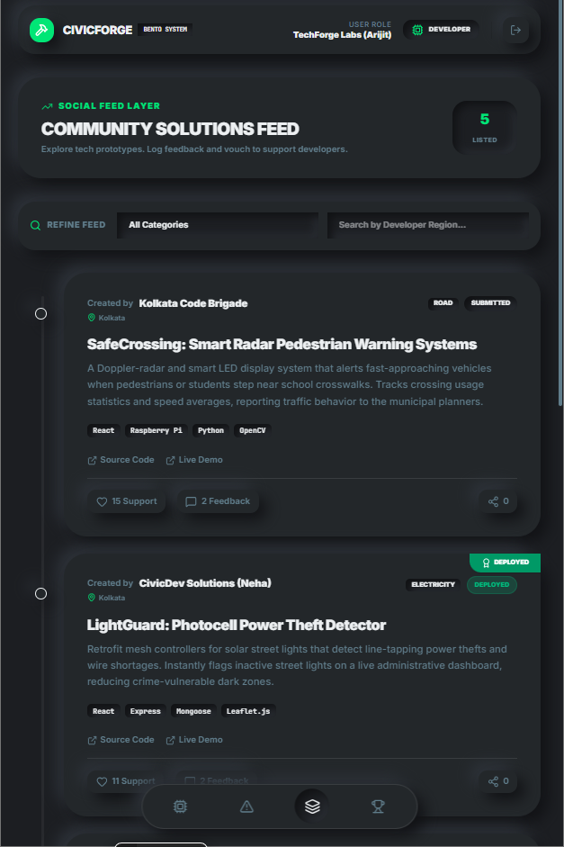
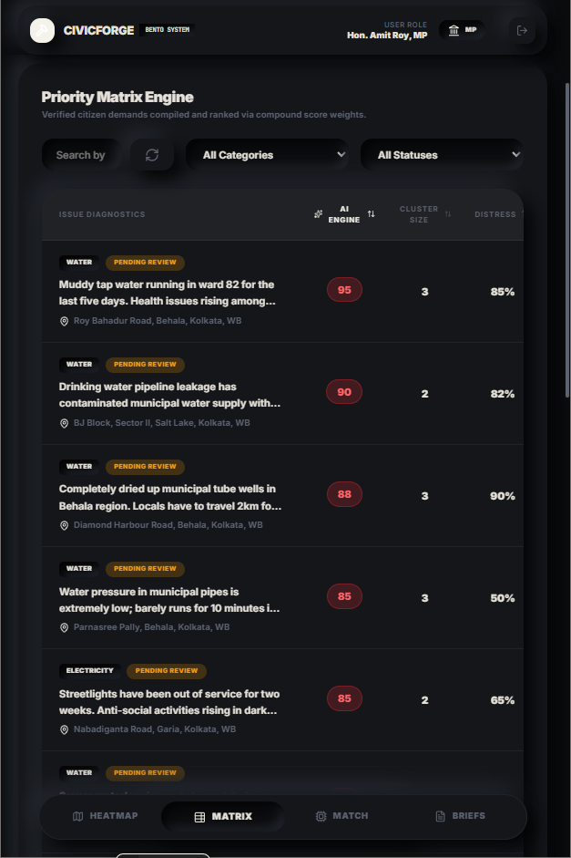
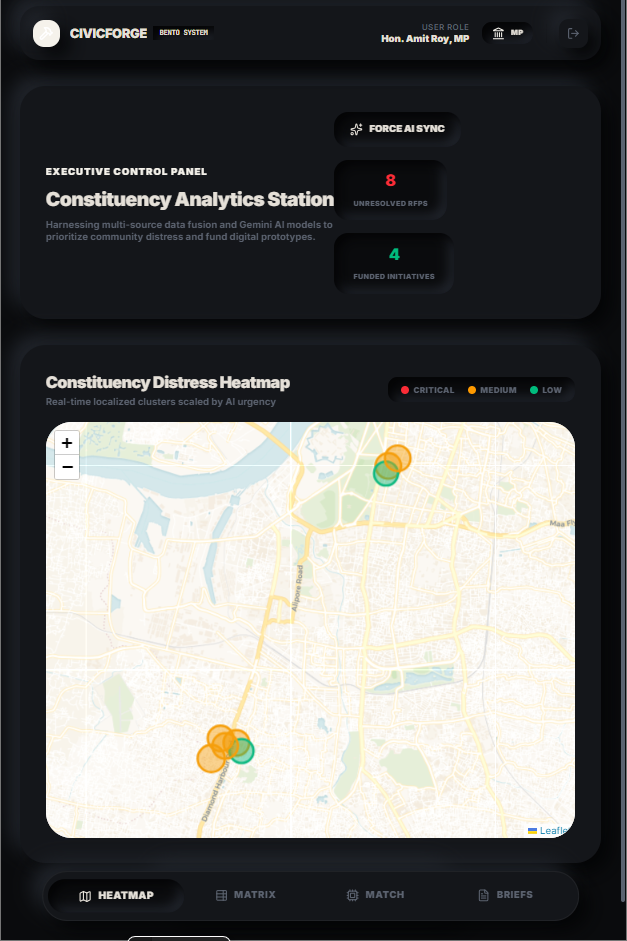
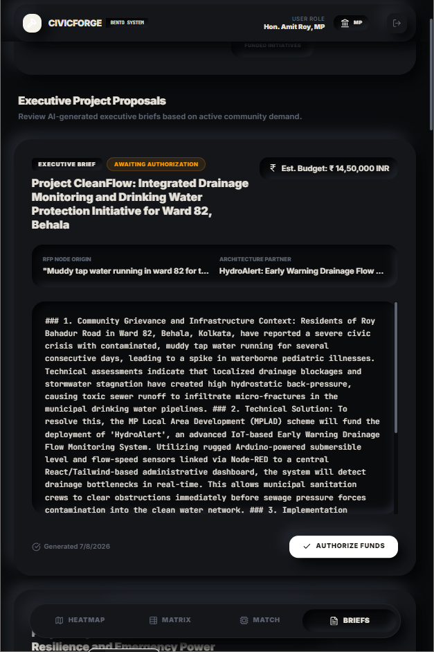

# 🏛️ CivicForge

> **Forging Data-Driven Constituency Progress.**
> *A dual-engine civic-tech ecosystem that replaces manual administrative guesswork with empirical data analytics and rapid crowdsourced execution.*

## 📖 Overview

CivicForge bridges the operational gap between parliamentary planning and real-time public demands by linking citizens, developers, and representatives on a unified digital canvas. By converting unstructured public distress signals into quantified geographic demands, the system automatically pairs localized infrastructure deficits with ready-to-deploy open-source solutions.

The platform utilizes a dynamic **Tri-Theme "Bento" Design System** that completely transforms the user interface—colors, shadow depth, and layouts—based on the authenticated user's role.

---

## 🖼️ Visual Interface & Tri-Theme Architecture

### Citizen Hub (Light Mint Green Theme)
Empowering citizens to report issues with a frictionless, social-media-style vertical timeline.
<p align="center">
  
  
  
</p>

### Developer Marketplace (Dark Charcoal Theme)
A high-contrast, code-centric workspace for technical users to find civic RFPs and submit technical prototypes.
<p align="center">
  
  
</p>

### Executive Evaluation Station (Dark Noir Theme)
A premium dashboard for Members of Parliament featuring AI-prioritized matrices, live heatmaps, and automated funding proposals.
<p align="center">
  
  
  
</p>

---

## ✨ Core Architecture & Features

The platform operates on a three-layer system designed for transparency, speed, and accountability:

### 1. Citizen Ingestion Layer (The Input)
* **Omnichannel Submissions:** Residents lodge geotagged infrastructure complaints using text, photos, or raw voice notes.
* **AI Processing:** Whisper AI translates and transcribes multilingual inputs, while Google Gemini extracts category tags and indexes emotional distress scales.
* **High-Precision Geotagging:** Locks exact coordinates for every grievance.

### 2. MP Priority Matrix (The Triage)
* **Geospatial Data Fusion:** Uses MongoDB `2dsphere` location clustering to cross-reference incoming reports against open government datasets, calculating structural travel distance gaps (Gap KM).
* **Distress Heatmap:** Algorithmically ranks and visualizes infrastructure issues into a live, urgency-scaled spatial heatmap for Members of Parliament.

### 3. Developer Marketplace (The Execution)
* **Solution Registry:** Local tech talent registers functional, open-source prototypes (apps, IoT hardware) tagged to specific municipal categories.
* **Automated Matchmaking:** An intelligent recommendation layer directly couples verified regional structural deficits with community-built solutions.
* **One-Click Funding Blueprints:** Once an MP authorizes a problem-solution match, Gemini instantly auto-generates a structured, data-backed development funding proposal for immediate administrative execution.

---

## 🛠️ Technology Stack

**Frontend**
* React 18 & Vite
* Tailwind CSS (Custom Neumorphic Engine)
* Leaflet.js (Interactive Geospatial Mapping)
* Lucide React (Iconography)

**Backend & Database**
* Node.js & Express.js
* MongoDB (Document storage & `2dsphere` geospatial indexing)
* Firebase (User Authentication & Asset Storage)

**Artificial Intelligence**
* Google Gemini AI SDK (Gemini 2.0 Flash)
* Whisper AI (Audio processing)

---

## 🚀 Getting Started

### Prerequisites
* Node.js (v18 or higher)
* MongoDB database instance
* Firebase Project Setup
* API Keys for Google Gemini and Whisper AI

### Installation

1. **Clone the repository**
   ```bash
   git clone [https://github.com/your-username/CivicForge.git](https://github.com/your-username/CivicForge.git)
   cd CivicForge
   ```
   
2. **Install dependencies**
   ```bash
   npm install
   ```


3. **Environment Configuration**
   Create a `.env` file in the root directory and add your keys:
   ```env
   MONGO_URI=your_mongodb_connection_string
   FIREBASE_API_KEY=your_firebase_key
   GEMINI_API_KEY=your_gemini_api_key
   WHISPER_API_KEY=your_whisper_api_key
   ```


4. **Run the development server**
   ```bash
   npm run dev
   ```

---
<div align='center'>

***CivicForge** — Built for the community, by the community.*
</div>